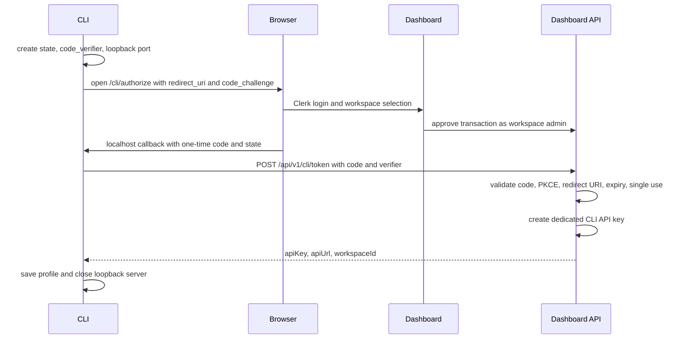

# BeeCrawl CLI Design Baseline

Status: Confirmed design, 2026-08-08

This document is the implementation baseline for BeeCrawl CLI. It follows the local Firecrawl CLI's task verbs, npm distribution, Agent Skill installation, and onboarding approach, while remaining grounded in BeeCrawl's current Node SDK, v2 API, and Dashboard Clerk/workspace boundaries.

## 1. Conclusion

BeeCrawl CLI is an independent TypeScript/Node.js npm package. Its package name is `beecrawl-cli` and its executable is `beecrawl`. It lives in `apps/cli` in the BeeCrawl core repository and calls the public BeeCrawl API through `beecrawl-sdk`. It does not access the Dashboard database, Clerk tokens, frontend code, or internal services directly.

The first release covers the six data capabilities most useful to Agents:

- `search`
- `scrape`
- `map`
- `extract`
- `crawl`
- `agent`

The command model reserves space for the complete public API. `parse`, `browser/interact`, `monitor`, and `batch scrape` will be added as later capabilities without changing the initial command names.

## 2. Architecture Boundaries

```text
Coding Agent / Terminal
        │
        ▼
beecrawl-cli  ───────────────► beecrawl-sdk
        │                              │
        │                              ▼
        └──────────────────────► BeeCrawl public API

beecrawl login ──browser──► Dashboard / Clerk / Workspace
                              │
                              └── creates dedicated CLI API key
```

The Dashboard is the control plane: it handles user login, workspace selection, admin permission checks, and CLI key creation. The BeeCrawl API is the data plane: it handles search, scrape, crawl, Agent, and other execution capabilities. The CLI only holds the API key issued through Dashboard authorization.

## 3. Package and Directory Design

```text
apps/cli/
├── package.json                 # name: beecrawl-cli, bin: beecrawl
├── tsconfig.json
├── README.md
├── src/
│   ├── main.ts                  # process entry point and global flags
│   ├── commands/                # task verbs and lifecycle commands
│   ├── auth/                    # login, loopback, PKCE, token exchange
│   ├── config/                  # profiles and protected local store
│   ├── api/                     # v2 SDK adapter and Job polling
│   ├── output/                  # Markdown/JSON rendering and diagnostics
│   ├── options/                 # flags + JSON options merge/validation
│   └── skills/                  # Agent adapters and installation behavior
└── skills/
    └── beecrawl/
        └── SKILL.md             # versioned bundled Agent Skill
```

`apps/cli` will be added to the root `pnpm-workspace.yaml`. The runtime requirement is Node.js `>=18`. The CLI reuses the existing `beecrawl-sdk` and does not duplicate HTTP, authentication headers, error parsing, or Job polling logic.

## 4. Command Tree

### Data Capabilities

```bash
beecrawl search <query>
beecrawl scrape <url>
beecrawl map <url>
beecrawl extract <url> [url...]
beecrawl crawl <url>
beecrawl crawl start <url>
beecrawl crawl status <job-id>
beecrawl crawl cancel <job-id>
beecrawl agent <prompt>
beecrawl agent start <prompt>
beecrawl agent status <job-id>
beecrawl agent cancel <job-id>
```

### Local Management

```bash
beecrawl login [--profile <name>]
beecrawl logout [--profile <name>]
beecrawl profile list
beecrawl profile current
beecrawl profile use <name>
beecrawl profile remove <name>
beecrawl init --all
beecrawl init --agent <claude-code|codex|opencode>
```

`logout` only removes the local profile; it does not revoke the remote key. The Dashboard owns the remote key lifecycle.

### Reserved Commands

```bash
beecrawl batch scrape <url> [url...]
beecrawl batch scrape start <url> [url...]
beecrawl parse <file>
beecrawl browser ...
beecrawl interact ...
beecrawl monitor ...
```

Reserved commands may be added in later versions, but they must not reinterpret existing top-level verbs.

## 5. Global Flags and Precedence

```bash
beecrawl --profile production search "web scraping"
beecrawl --format json scrape https://example.com
beecrawl --api-key "$BEECRAWL_API_KEY" --base-url http://127.0.0.1:8000 scrape https://example.com
```

Identity and endpoint precedence:

1. Explicit CLI flags: `--profile`, `--api-key`, `--base-url`
2. Environment variables: `BEECRAWL_PROFILE`, `BEECRAWL_API_KEY`, `BEECRAWL_BASE_URL`
3. The local active profile
4. The `default` profile

The Dashboard URL is supplied through `--dashboard-url` or `BEECRAWL_DASHBOARD_URL`. The default is `https://dashboard.beecrawl.dev`.

CLI flags consistently use kebab-case. JSON in `--options` and `--options-file` preserves API payload field names. Explicit flags override JSON options during merging, and positional arguments take precedence for `url`/`query`/`prompt`.

## 6. Local Configuration and Profiles

Platform-default paths:

```text
macOS:   ~/Library/Application Support/beecrawl/config.json
Linux:   $XDG_CONFIG_HOME/beecrawl/config.json
         or ~/.config/beecrawl/config.json
Windows: %APPDATA%\beecrawl\config.json
```

Configuration example:

```json
{
  "version": 1,
  "currentProfile": "default",
  "profiles": {
    "default": {
      "apiUrl": "https://api.beecrawl.dev",
      "apiKey": "bcr_...",
      "workspaceId": "workspace-id",
      "source": "dashboard-login",
      "createdAt": "2026-08-08T00:00:00.000Z"
    }
  }
}
```

Constraints:

- The key is written to the local configuration at the user's request; OS Keychain is not required.
- Unix file permissions are `0600`; on Windows, the file is restricted to the current user.
- Writes use a temporary file, flush, and rename to avoid leaving a partially written configuration.
- `init` never reads or modifies API keys.
- A single CLI installation supports multiple named profiles.
- `profile remove` only removes the local profile and does not affect the Dashboard-side key.

## 7. Dashboard Login Protocol

`beecrawl login` uses a temporary loopback server, PKCE S256, and a random state value:



Recommended Dashboard endpoints:

```text
GET  /api/v1/cli/authorize
POST /api/v1/cli/authorize/approve
POST /api/v1/cli/token
```

Implementation constraints:

- `/authorize` is a Dashboard frontend authorization page, not an endpoint for the CLI to obtain a key directly.
- `/authorize/approve` requires Clerk authentication and only permits workspace admins.
- The Authorization Transaction stores the profile name, workspace ID, redirect URI, PKCE challenge, expiry, and consumption state.
- Only a hash of the code is stored. The code is valid for five minutes and can be exchanged only once.
- The key is created only after a successful token exchange, preventing interrupted authorization from producing orphaned keys.
- The API URL is returned by the authorized environment; the CLI must not infer an API hostname from the Dashboard hostname.
- The API key must not appear in the URL, state, or browser history.
- If the browser cannot be opened automatically, print the authorization URL and support `--no-browser`.

## 8. Command Semantics

### search

```bash
beecrawl search "web scraping" \
  --limit 20 \
  --source web \
  --category research \
  --include-domain arxiv.org \
  --exclude-domain example.com \
  --lang zh \
  --country cn
```

High-frequency flags are `limit`, repeated `source`, `category`, `include-domain`, `exclude-domain`, `lang`, and `country`. Complex fields such as location, time filters, and nested scrape options use `--options`.

### scrape

```bash
beecrawl scrape https://example.com \
  --content-format markdown \
  --content-format links \
  --timeout-ms 30000 \
  --wait-for-ms 500 \
  --only-main-content \
  --only-clean-content \
  --include-tag article \
  --exclude-tag nav
```

`--format` controls the final CLI representation, while `--content-format` controls the content formats requested from the scrape service. A valid URL can be used as a shorthand:

```bash
beecrawl https://example.com
```

This is equivalent to `beecrawl scrape https://example.com`. Other inputs are not implicitly guessed to be search or agent prompts.

### map

```bash
beecrawl map https://example.com \
  --limit 500 \
  --search docs \
  --include-subdomains
```

The first-release flags are `limit`, `search`, `include-subdomains`, `sitemap`, and `ignore-query-parameters`. Other fields use options. Map is a synchronous command and defaults to JSON.

### extract

```bash
beecrawl extract https://a.com https://b.com \
  --schema-file schema.json
```

`extract` accepts one or more URLs and maps them to the v2 `urls` array. `--schema` and `--schema-file` are mutually exclusive. `--prompt` may be supported later, but the command must not run without either a schema or a prompt.

### crawl

```bash
beecrawl crawl https://example.com \
  --limit 100 \
  --max-depth 2 \
  --include-path /docs \
  --exclude-path /blog \
  --max-concurrency 5
```

`crawl <url>` submits a v2 Job and waits for a terminal state by default. `start` only submits, `status` queries, and `cancel` cancels; `crawl <url> --no-wait` is a convenience alias for `start`. The default wait timeout is 300 seconds and the default polling interval is 1 second. On timeout, exit code 7 is returned and the known Job ID is written to stderr.

`--max-depth` maps to v2 `maxDiscoveryDepth`; CLI flags remain kebab-case.

### agent

```bash
beecrawl agent "Find the pricing plans for Notion" \
  --url https://notion.so \
  --url https://notion.so/pricing \
  --max-credits 5
```

The prompt supports a positional argument, `--prompt`, `--prompt-file`, and `--prompt-file -`. Agent commands block by default; `start`/`status`/`cancel` reuse the Job lifecycle.

## 9. Output, Errors, and Retries

Output rules:

- `scrape` outputs Markdown content by default.
- `search`, `map`, `extract`, `crawl`, and `agent` output JSON by default.
- `--format json|markdown` overrides the default representation.
- `--json` is equivalent to `--format json`.
- stdout contains only the Command Result. Progress, polling, warnings, and diagnostics go to stderr.
- The first release does not add an `--output` file flag. Shell redirection is used instead, so file-writing semantics do not become fixed before the result shape.

Exit codes:

```text
0 success
1 unknown error
2 usage/validation error
3 auth/profile error
4 not found
5 rate limit/quota
6 network/server error
7 Job failed or wait timeout
```

With `--json`, errors are also written as JSON to stderr and retain server details, HTTP status, and request ID. Job creation requests are not retried implicitly; status reads may use bounded retries. Safe retries for creation requests are allowed only when an idempotency key is explicitly supplied.

## 10. Agent Skill Init

The Skill is distributed with the npm package and versioned with the CLI. The first release supports Claude Code, Codex, and OpenCode:

```bash
beecrawl init --all
beecrawl init --agent codex
beecrawl init --all --scope project
beecrawl init --all --dry-run
```

By default, installation writes to the user's global Skill directory. `--scope project` is required to write to the current repository. The first release installs only the Skill; it does not modify MCP configuration, shell profiles, or other Agent configuration.

Repeated execution rules:

- Files marked as managed by BeeCrawl may be updated.
- Files with the same name but without a management marker are skipped with a warning by default.
- `--force` is required to overwrite unmanaged files.
- `--dry-run` does not write to disk.

Skill content must match the first-release command set. It must explicitly tell Agents to prefer `beecrawl login`, use stable JSON/Markdown output with an existing profile, and pass complex parameters through `--options-file`.

## 11. SDK/API Adapter

The CLI uses only the v2 SDK surface:

```text
search  → v2Search
scrape  → v2Scrape
map     → v2Map
extract → v2Extract
crawl   → v2Crawl + v2JobStatus
agent   → createAgent + getAgent
```

The CLI does not expose `/v2`, mix legacy response shapes, or duplicate the `X-Web-Extract-Api-Key` authentication implementation. It configures the API key through `beecrawl-sdk`, while the public gateway performs validation.

## 12. Testing and Release Phases

### Phase 1: CLI Core

- `apps/cli` package, command parser, and flags/options merge.
- v2 SDK adapter, output renderer, and stable exit codes.
- Profile/config store, permissions, and atomic writes.
- `search`/`scrape`/`map`/`extract`/`crawl`/`agent` commands.
- Mock-fetch tests without starting a real API.

### Phase 2: Dashboard Login

- Dashboard authorization transaction migration.
- Clerk authorization page and workspace-admin checks.
- Loopback callback, PKCE, and one-time token exchange.
- Profile persistence and login/logout tests.

### Phase 3: Agent Skill

- Bundled `SKILL.md`.
- Claude Code, Codex, and OpenCode adapters.
- Global/project scope, dry-run, managed marker, and force behavior.

### Phase 4: Release

```bash
pnpm --filter beecrawl-cli build
pnpm --filter beecrawl-cli test
npm publish --access public
```

The release gate must cover at least: parser, config permissions, PKCE/state, Dashboard exchange mock, output separation, Job timeout, init idempotency, and `npx -y beecrawl-cli@latest --help`.

## 13. Acceptance Scenarios

1. A new user runs `beecrawl login`, signs in in the browser, selects a workspace, and the CLI saves the `default` profile.
2. The user logs in to a second environment with `--profile staging` without overwriting production.
3. With an existing profile, `beecrawl scrape URL` writes only Markdown to stdout.
4. An Agent runs `beecrawl search QUERY --json`; stdout is parseable JSON and stderr is free of progress noise.
5. After a crawl timeout, the CLI returns exit code 7 and a Job ID; `status` can continue querying it.
6. `beecrawl init --all --dry-run` does not modify files; the second init is idempotent; unmanaged files are not overwritten.
7. `beecrawl logout` removes the local profile but does not call a remote revocation endpoint.
8. API responses 401/429/5xx map to stable exit codes and retain structured diagnostics.

## 14. Explicit Non-Goals

- The first release does not implement credential providers other than Dashboard browser login.
- The first release does not put API keys in URLs, Skill files, MCP configuration, or shell profiles.
- The first release does not revoke remote keys from the CLI.
- The first release does not read the Dashboard database directly.
- The first release does not automatically retry POST requests that might create duplicate Jobs.
- The first release does not implement complete browser/interact, parse, or monitor commands.
